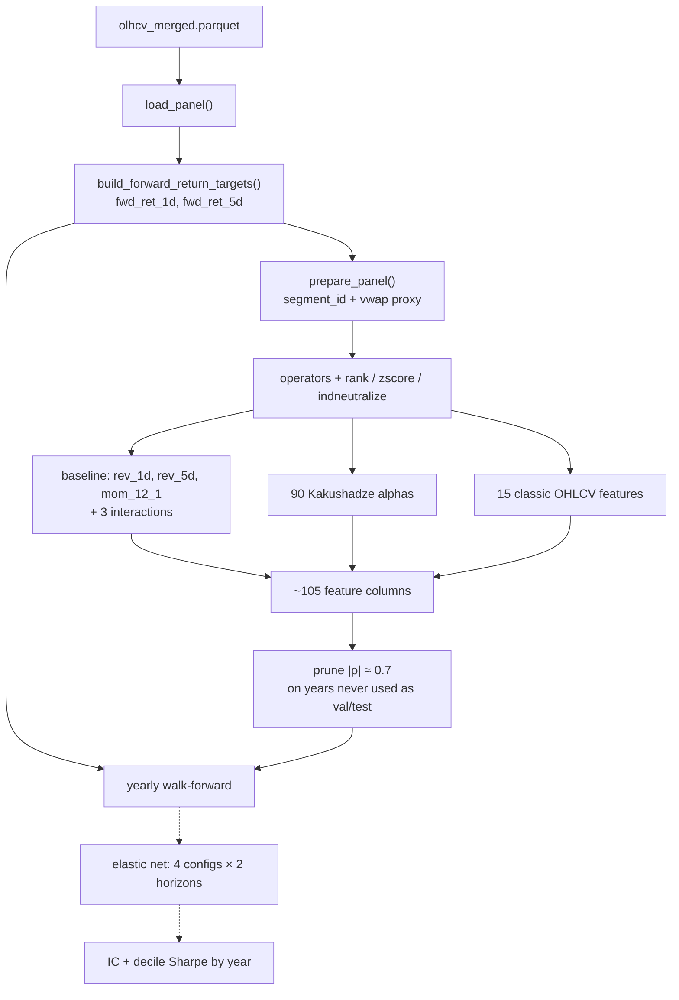

# Technical Signal Discovery from OHLCV Data

Do OHLCV technical signals carry 1- and 5-day predictive content for U.S.
equities beyond a 3-feature linear baseline? Report: `Report/main.tex`.

**Data note:** the input panel (`data/olhcv_merged.parquet`, CRSP daily data
obtained via WRDS) is licensed and not redistributable, so it is not included
in this repository.

## How the repo works

One shared `src/` — load data, build targets, and build features from here.
Do not hand-roll a second loader, forward return, or operator.



All displayed pipeline stages are implemented. The legacy
`src/evaluation.py` stub is unused; scorecard metrics and figures live in
`src/scorecard.py` and `run_report_figures.py`.
Prune is `src/prune.py`; freeze years 2001–2010 are never val/test
(full universe, not daily top 500).

Typical call order:

```python
import pandas as pd

from src.data import load_panel, build_forward_return_targets
from src.signals import prepare_panel, build_baseline_features
from src.signals.alphas import build_alpha_features
from src.signals.classic_features import build_classic_features

raw = load_panel(top_n=None)                        # full universe; optional year bounds
with_targets = build_forward_return_targets(raw)    # fwd_ret_1d, fwd_ret_5d; needs permno/date as columns
panel = prepare_panel(with_targets)                 # required before any operator; moves permno/date into the index
X = pd.concat(
    [
        build_baseline_features(panel),
        build_alpha_features(panel),      # ~42 min on the full panel
        build_classic_features(panel),
    ],
    axis=1,
)
```

After prune, the frozen column list is `configs/pruned_features.json` (`keep`).

`ret` is backward-looking. The only legal forward return is
`build_forward_return_targets`. Time-series operators refuse to blend a
stock across a >10-day panel exit/re-entry (`segment_id`).

## Layout

```
Report/main.tex               report
src/data.py                   load_panel, targets, segment_id
src/signals/                  operators, baseline, 90 alphas, 15 classic
src/prune.py                  freeze-year prune; configs/pruned_features.json
src/validation.py             yearly walk-forward
src/scorecard.py              IC, decile portfolios, and yearly metrics
notebook.ipynb                runnable submission walkthrough
```

## Setup

The loader looks for the CRSP daily panel at `data/olhcv_merged.parquet`
(not included — see the data note above). With the parquet in place:

```bash
uv sync
uv run jupyter nbconvert --execute --to notebook --inplace notebook.ipynb
```

Large model-prediction files are likewise not committed. The notebook executes
a small live demonstration, then reproduces the report from committed summary
artifacts. Full regeneration requires the source parquet.

## Contributors

Group project:

- [Ahmad Mohammad](https://github.com/ahmedas91)
- [Ritvik Verma](https://github.com/ritvikverma)
- [Tate Gilbertson](https://github.com/tategilbertson-blip)
- [Neel Padhye](https://github.com/neelpadhye-bit)
